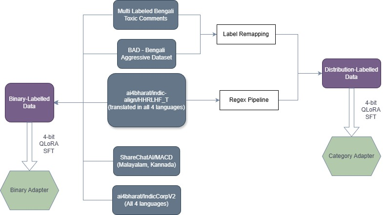

# **TL;DR:**
- A multilingual toxicity & safety classification framework targeting native Indian languages.
- Engineered a multi-source toxic dataset of 380,000+ samples by integrating disparate corpora (Indic-Align, IndicCorpV2, ShareChatAI/MACD) using custom regex cleaning and label remapping pipelines.
- Fine-tuned a Qwen-3-1.5B-Instruct model using QLoRA, achieving 95.60% overall accuracy and a 0.9635 F1-score.
- Validated model robustness using 0.9080 Cohen's Kappa for binary classification, ensuring consistent classification performance and strong retrieval capability at 68.3% top-3 recall for multiclass toxicity classification.

## Tech Stack

| Category | Technologies |
| --- | --- |
| **Base Model & Training** | Qwen-3-1.5B-Instruct, HuggingFace, QLoRA, PyTorch |
| **Data Processing** | Python, Custom Regex Pipelines |
| **Frontend Web Portal** | React, HTML/CSS |
| **Evaluation Metrics** | Cohen's Kappa, F1-score, KL-divergence, mAP, Top-k Recall |

---

# The Problem

* With the rise of social media and online platforms, the spread of toxic content has become a significant concern. Especially with the native Indian languages that is more concerning and there is less research and development in this area compared to English.
* There is a need for an open source AI model that can detect and filter out toxic content from online platforms in native Indian languages. There are some existing models but they are either not very accurate or not open source. 

---

# Core Features

* **Multilingual Support:** Supports toxicity and safety classification across low-resource Indic languages (including Bengali, Odia, Malayalam, and Kannada).
* **Two-Head Architecture:** Utilizes dual LoRA adapters — a binary classifier for SAFE / HARMFUL detection and a fine-grained distribution head over 17 distinct safety categories.
* **Efficient Parameter Tuning:** Implements 4-bit QLoRA quantization to effectively fine-tune large language models efficiently.
* **Custom Data Curation Pipeline:** Programmatically integrates and standardizes distinct public corpora (Indic-Align, IndicCorpV2, ShareChatAI/MACD) into a unified toxic dataset.
* **Inference Web Portal:** Features a complete web application to run real-time predictions, language selection, and distribution visualization over the toxicity models.

---
# Flowchart

---

# High-Level Architecture


*Architecture flow demonstrating how disparate corpora are curated into a 380k+ dataset and fed into a Qwen-3-1.5B-Instruct model fine-tuned with separate QLoRA adapters for binary and multiclass toxicity inference.*

---

# The Technical Deep Dive

* **Dataset Engineering & Normalization:** Aggregated raw-text datasets from Indic sources into a unified framework. Built a custom regex-based safety category extraction pipeline to clean the text, propagated English labels to translated samples, and generated soft label distributions.
* **Dual-Head LoRA Adapter Finetuning:** Instead of a single generalized head, attached two distinct QLoRA heads for the binary and distribution tasks. The Binary adapter explicitly predicts SAFE or HARMFUL, while the Distribution adapter performs text-to-text generation to predict probabilities across 17 safety categories.
* **Comprehensive Model Evaluation:** Validated against zero-shot baselines (Llama-3.2-1B-Instruct, Aya-8B) and few-shot prompt-based techniques. Robustness is strictly evaluated using complex statistical metrics like F1-score, Cohen's Kappa, KL-divergence, and mAP, yielding high top-k recall.

---

# Results & Learnings

* **Performance Overview:** Achieved an impressive 95.60% overall accuracy and a 0.9635 F1-score for toxicity detection.
* **Robust Binary Classification:** Demonstrated high model reliability with 0.9080 Cohen's Kappa for the binary SAFE/HARMFUL decision.
* **Multiclass Capability:** Reached 68.3% top-3 recall for the 17-category multiclass classification.
* **Core Learnings:** Mastered the complex integration of multi-label toxic data from sparse Indic datasets into a unified format and optimized efficient training procedures (QLoRA) for low-resource languages.

---

# Future Work

* Expand the model capabilities to handle code-mixed (e.g., Hinglish) and heavily transliterated toxic text formats.
* Develop an optimized inference endpoint (using vLLM or ONNX) to significantly reduce inference latency in real-time moderation deployments.

---

# Links

* **GitHub Repository:** <a href="https://github.com/PranjalGoyal06/UnityAI-Guard-2.0" target="_blank">link</a>
* **Dataset:** <a href="https://huggingface.co/datasets/advaitIITGN/unity_AI_guard_v2_dataset" target="_blank">link</a>
* **Project Page:** <a href="https://lingo.iitgn.ac.in/unity-ai-guard-2/" target="_blank">link</a>
* **Binary Head:** <a href="https://huggingface.co/prolaxmi/qwen-moderation-binary" target="_blank">link</a>
* **Multiclass Head:** <a href="https://huggingface.co/prolaxmi/qwen-moderation-multiclass" target="_blank">link</a>

